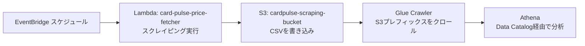

<!-- generated-by:readmeai -->
# CardPulse

## 概要
- AWS SAMでトレカ価格スクレイパーとデータ投入パイプラインを構築するリポジトリ
- 指定ドメインのカード一覧ページを巡回し、カードID・名称・価格・レアリティ・詳細URLをCSVとしてS3に保存
- GlueクローラーとAthenaワークグループを含むデータ収集・参照環境をInfrastructure as Codeで管理

### データフロー（Mermaid）

※すべて `template.yaml` で定義され、`sam deploy` により一括デプロイされます。

### スクレイピング可能なサイト

- **カードラボ**
    - シングルカード一覧（https://www.c-labo-online.jp/product-list/xxx）に掲載されている全てのカードについて、名称・値段・レアリティなどを取得します。

## 使用方法
- 前提: Python 3.13系、AWS CLI、SAM CLI、AWS認証情報が利用可能であること。
- 依存ライブラリ確認（ローカル動作確認時など任意）:
    - `pip install -r functions/price_fetcher/requirements.txt`
- ビルドとデプロイ:
    - `sam build --use-container`
    - `sam deploy --guided`（DataPrefixやLambdaEventJsonを入力）
    - テンプレート引数:
        | パラメータ | 役割 | 例 |
        | --- | --- | --- |
        | ScrapingDataPrefix | スクレイピング結果を格納するS3プレフィックス。Glueクローラーもこのパスを参照。 | `cardlabo` |
        | CsvContainsHeader | CSVにヘッダ行があるかの判定。`PRESENT`/`ABSENT`/`UNKNOWN`。 | `PRESENT` |
        | CsvDelimiter | CSVの区切り文字。 | `,` |
        | CsvQuoteSymbol | CSVのクォート文字。 | `"` |
        | LambdaEventJson | EventBridge経由でLambdaに渡すイベントJSON。`target_uris`を含める。 | `{"target_domain": "https://www.c-labo-online.jp/product-list/", "target_uris": ["3055/0/photo", "3193/0/photo"]}` |
- 実行パラメータ:
    - Lambdaは`target_uris`を含むイベントを受け取り、`target_domain`と結合したURLを巡回する。
    - 例: `{"target_domain": "https://www.c-labo-online.jp/product-list/", "target_uris": ["3055/0/photo", "3193/0/photo"]}`
- 出力:
    - `cardlabo/card_type=ws/dt=YYYY-MM-DD-HH-MM/data.csv`形式で`cardpulse-scraping-bucket`にCSVを保存。

## ファイル一覧
| ファイル | 説明 |
| --- | --- |
| .gitignore | Python/IDE生成物やSAMビルド成果物を除外する設定。 |
| template.yaml | SAMテンプレート。スクレイピング結果格納用S3、Lambda（card-pulse-price-fetcher、毎日00:00 JST実行）、Glueデータベース/クローラー、Athenaワークグループを定義し、DataPrefixやCSV判定のパラメータを受け取る。 |
| functions/price_fetcher/app.py | Lambdaエントリーポイント。`target_uris`で受け取った一覧ページを取得・解析し、CSVを書き出してS3へ保存する。 |
| functions/price_fetcher/card_labo/card_element.py | 商品リストのDOMからカード名・ID・価格・レアリティ・詳細URLを抽出するパーサー。 |
| functions/price_fetcher/card_labo/card_list_page.py | HTMLを解析してカード要素群とページャーリンクを取得するユーティリティ。 |
| functions/price_fetcher/card_labo/card_list_page_manager.py | 1ページ目とページャー先を非同期で取得し、全ページのカードリストをまとめる管理クラス。 |
| functions/price_fetcher/interface/__init__.py | パーサー関連インターフェースのエクスポート。 |
| functions/price_fetcher/interface/i_card_element.py | カード要素の抽象インターフェース。 |
| functions/price_fetcher/interface/i_card_list_page.py | カード一覧ページの抽象インターフェース。 |
| functions/price_fetcher/interface/i_card_list_page_manager.py | カード一覧管理クラスの抽象インターフェース。 |
| functions/price_fetcher/requirements.txt | Lambdaで利用するライブラリの依存定義（BeautifulSoup、aiohttp、requests、boto3、lxml）。 |

## 注意事項
- 本リポジトリのスクレイピング機能は学習目的で作成したものであり、利用に伴う結果について責任を負いません。対象サイトの利用規約と関連法令を必ず確認した上で自己責任で利用してください。
- アクセス負荷を避けるため、コード内のクールタイム（1秒スリープ）などの節度を保った利用を行ってください。
